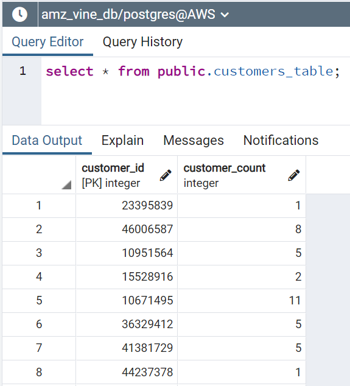

# Amazon_Vine_Analysis

## Overview
Amazon Vine program allows manufacturers and publishers to receive reviews for their products by providing Amazon Vine members their products in exchange for a review. An analysis was done to determine any bias in the program for positive reviews. AWS was utilized for hosting the data and Pyspark performed the extract and transformation of data.  
  
  
  
  
  
  
  
  
  
## Results
The data was extracted from the automotive dataset into DataFrames and then filtered by votes of 20 or more and where helpful votes were at least 50 percent of the total votes. This would provide a sample of the most read reviews by shoppers to perform our analysis on.  
  
1. The total amount of reviews were 24,824 based on the above criteria.  
2. The total amount of five star reviews were 12,840 which is 51.72 percent of the total reviews.  
3. Of the five star reviews, only 34 were from the Vine program and 12,806 were non-Vine reviews.  
4. 0.26 percent were Vine reviews and 99.74 percent werer non-Vine reviews.  
  
  

## Summary
The calculations show there is not a positive bias towards reviews of the Vine program. We can see the majority of the top five star reviews were written by non-Vine members. This could be the results of the automotive category where the program is not commonly used. A more comprehensive analysis is to compare the other category datasets to determine if this is the case.  